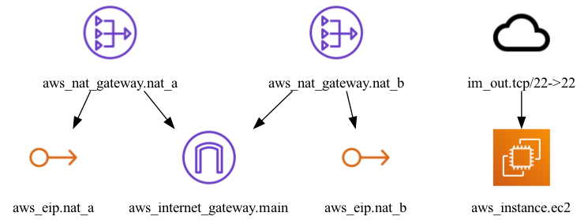

# Saba

Production-ready, multi-AZ AWS VPC infrastructure with Terraform.

## Overview

Saba is a modular Terraform project that provisions a secure, highly-available VPC architecture on AWS. It implements AWS best practices for network isolation, redundancy, and secure access patterns commonly used in production environments.

### Key Features

- **Multi-AZ Deployment** - Resources spread across two availability zones for high availability
- **Network Isolation** - Public and private subnet tiers with proper routing
- **Redundant NAT Gateways** - One per AZ to eliminate single points of failure
- **Bastion Host** - Secure jump server for SSH access to private resources
- **Modular Design** - Reusable modules for networking and bastion components

## Architecture



```
                    ┌─────────────────────────────────────────────────────────┐
                    │                         VPC                             │
                    │                    10.0.0.0/16                          │
                    │                                                         │
                    │   ┌─────────────────────┐   ┌─────────────────────┐     │
                    │   │   Public Subnet A   │   │   Public Subnet B   │     │
                    │   │    10.0.1.0/24      │   │    10.0.2.0/24      │     │
                    │   │      (AZ-A)         │   │      (AZ-B)         │     │
    Internet ───────┼───│                     │   │                     │     │
        │           │   │  ┌─────┐  ┌─────┐   │   │      ┌─────┐        │     │
        │           │   │  │ NAT │  │Bast-│   │   │      │ NAT │        │     │
        └───────────┼───│  │ GW  │  │ ion │   │   │      │ GW  │        │     │
                    │   │  └──┬──┘  └─────┘   │   │      └──┬──┘        │     │
                    │   └─────┼───────────────┘   └─────────┼───────────┘     │
                    │         │                             │                 │
                    │   ┌─────┴───────────────┐   ┌─────────┴───────────┐     │
                    │   │  Private Subnet A   │   │  Private Subnet B   │     │
                    │   │    10.0.10.0/24     │   │    10.0.20.0/24     │     │
                    │   │      (AZ-A)         │   │      (AZ-B)         │     │
                    │   │                     │   │                     │     │
                    │   │   ┌───────────┐     │   │    ┌───────────┐    │     │
                    │   │   │ App/DB    │     │   │    │ App/DB    │    │     │
                    │   │   │ Servers   │     │   │    │ Servers   │    │     │
                    │   │   └───────────┘     │   │    └───────────┘    │     │
                    │   └─────────────────────┘   └─────────────────────┘     │
                    └─────────────────────────────────────────────────────────┘
```

## Project Structure

```
saba/
├── main.tf                 # Root module - orchestrates child modules
├── variables.tf            # Input variables
├── outputs.tf              # Output values
├── versions.tf             # Terraform/provider versions
├── providers.tf            # AWS provider configuration
├── architecture.png        # Infrastructure diagram
│
└── modules/
    ├── networking/         # VPC, subnets, NAT gateways, routing
    │   ├── main.tf
    │   ├── variables.tf
    │   └── outputs.tf
    │
    └── bastion/            # Security group, SSH key, EC2 instance
        ├── main.tf
        ├── variables.tf
        └── outputs.tf
```

## Usage

### Prerequisites

- [Terraform](https://www.terraform.io/downloads) >= 1.0.0
- [AWS CLI](https://aws.amazon.com/cli/) configured with credentials
- SSH key pair for bastion access

### Quick Start

```bash
# Clone the repository
git clone https://github.com/aidantrabs/saba.git
cd saba

# Generate SSH key for bastion access
ssh-keygen -t ed25519 -f ~/.ssh/bastion-key -C "bastion"

# Deploy
terraform init
terraform plan
terraform apply
```

### Connect to Bastion

```bash
ssh -i ~/.ssh/bastion-key ec2-user@$(terraform output -raw bastion_public_ip)
```

## Configuration

| Variable | Description | Default |
|----------|-------------|---------|
| `environment` | Environment name | `dev` |
| `aws_region` | AWS region | `us-east-1` |
| `vpc_cidr` | VPC CIDR block | `10.0.0.0/16` |
| `instance_type` | Bastion instance type | `t3.micro` |
| `allowed_ssh_cidr` | CIDR allowed to SSH | `0.0.0.0/0` |

## Outputs

| Output | Description |
|--------|-------------|
| `vpc_id` | VPC identifier |
| `public_subnet_ids` | Public subnet IDs |
| `private_subnet_ids` | Private subnet IDs |
| `bastion_public_ip` | Bastion host IP |

## Security Notes

- **SSH Access**: Default allows SSH from anywhere. Restrict `allowed_ssh_cidr` in production.
- **IMDSv2**: Bastion requires IMDSv2 for enhanced metadata security.
- **Encryption**: Root volumes are encrypted by default.

## License

MIT
