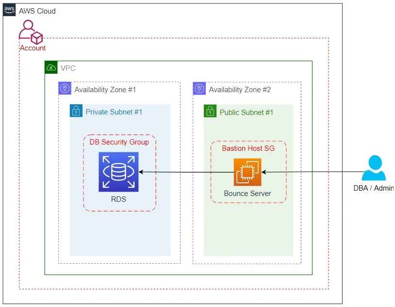
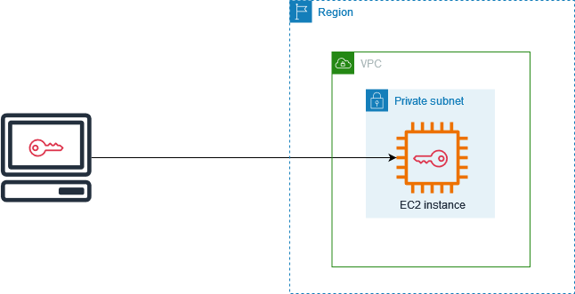

# Terraform

## Core Concepts

### 1. What's the difference between `terraform plan` and `terraform apply`?

- `terraform plan` checks whether the proposed changes match the expected output, whereas `terraform apply` actually executes the proposed changes. When you run `apply` alone, it still creates a plan and prompts for confirmation unless bypassed explicitly.
- You can save a plan to a file with `terraform plan -out=tfplan` and then run `terraform apply tfplan` to apply *exactly* that plan with no confirmation prompt. This is the pattern used in CI/CD pipelines to ensure what was reviewed is what gets applied.

### 2. What is *state* and why does Terraform need it?

- State is a way to map the configuration to resources in the real world. It came out of the issue that not all providers are the same; for example, some providers like AWS might have tags while others don't. The primary purpose of Terraform state is to store bindings between objects in a remote system and resource instances declared in the config.
- If you lose your state file and your infrastructure still exists, Terraform has no idea those resources belong to it. You'd have to `import` them manually or risk creating duplicates. This is why remote state backends (S3, Azure Blob, Terraform Cloud) exist.

### 3. What's a *provider* and why do you need to configure one?

- A provider is a plugin that Terraform uses to interact with cloud providers, SaaS providers, and other APIs. Each provider adds a set of resource types and/or data sources that Terraform can manage. You need to configure one to interact with a cloud platform/provider — it helps simplify management, making it easier to track changes. It also supports custom APIs and legacy systems, since Terraform may not natively support them, so a provider enables Terraform to manage those resources.
- Terraform Core is just an engine. It knows nothing about AWS, Azure, or anything else. Providers are the "drivers" that teach it how to talk to specific APIs.

### 4. What's the difference between a *resource* and a *data source*?

- A **resource** is an abstraction that allows Terraform to manage infrastructure objects (e.g., a compute instance).
- A **data source** is an abstraction that allows Terraform to reference external data.
- Resources = Terraform manages the lifecycle (create, update, delete). Data sources = read-only lookups of things that exist outside your config.

---

## AWS Provider

### 1. What's a CIDR (`Classless Inter-Domain Routing`) block and why does a VPC need one?

- A CIDR block is a collection of IP addresses that share the same network prefix and number of bits. A large block consists of more IP addresses and a small suffix.
- A VPC needs a CIDR block to define the range of IP addresses that can be used within that network, allowing for proper allocation and management of resources like subnets and instances. This helps ensure that the network is organised and can communicate effectively without IP address conflicts.

### 2. What's the difference between a public and private subnet?

- A **public subnet** is a subnet associated with a route table that has a route to an Internet Gateway (IGW). This route allows access from the public internet to the subnet.
- A **private subnet** is a subnet associated with a route table that *doesn't* have a route to an Internet Gateway. Resources in private subnets cannot communicate with the public internet.
- Any AWS resource that doesn't need access to the public internet should run in a private subnet (e.g., application servers, databases).


### 3. In the `aws_subnet` resource, what argument links a subnet to its parent VPC?

- `aws_subnet` provides a VPC subnet resource.
- The argument that links a subnet to its parent VPC is the `vpc_id` argument.
- Example usage:

```hcl
resource "aws_subnet" "main" {
  vpc_id     = aws_vpc.main.id
  cidr_block = "10.0.1.0/24"

  tags = {
    Name = "Main"
  }
}
```

---

## Building Production-Style Architecture

### Target Architecture

```
VPC (10.0.0.0/16)
├── Public Subnet A  (10.0.1.0/24) ─── Route Table ─── Internet Gateway
├── Public Subnet B  (10.0.2.0/24) ─── Route Table ─── Internet Gateway
├── Private Subnet A (10.0.10.0/24) ── Route Table ─── NAT Gateway
├── Private Subnet B (10.0.20.0/24) ── Route Table ─── NAT Gateway
└── Internet Gateway
└── NAT Gateway (in Public Subnet A)
```

```
VPC (10.0.0.0/16)
│
├── Internet Gateway
│
├── Public Subnet A (10.0.1.0/24, us-east-1a)
├── Public Subnet B (10.0.2.0/24, us-east-1b)
│   └── Route Table: 0.0.0.0/0 → Internet Gateway
│
├── Private Subnet A (10.0.10.0/24, us-east-1a)
├── Private Subnet B (10.0.20.0/24, us-east-1b)
│   └── Route Table: 0.0.0.0/0 → NAT Gateway
│
├── Elastic IP (for NAT)
└── NAT Gateway (lives in Public Subnet A)
```

```
Internet
    │
    ▼
┌─────────────────────────────────────────────────┐
│ VPC                                             │
│                                                 │
│  ┌─────────────────┐    ┌─────────────────┐     │
│  │ Public Subnet A │    │ Private Subnet A│     │
│  │                 │    │                 │     │
│  │  ┌───────────┐  │    │  (future app    │     │
│  │  │  Bastion  │◄─┼────┼─  servers)      │     │
│  │  │   Host    │  │SSH │                 │     │
│  │  └───────────┘  │    │                 │     │
│  └─────────────────┘    └─────────────────┘     │
└─────────────────────────────────────────────────┘
```

---

## Glossary

### Key Terms

| Keyword | Definition | Examples & Notes |
| --- | --- | --- |
| `Variable-Length Subnet Masking (VLSM)` | A technique used in networking that allows the division of an IP address space into subnets of different sizes, optimising the use of IP addresses and reducing waste. This method enables network administrators to allocate IP addresses more efficiently based on the specific needs of each subnet, rather than using a fixed size for all subnets. | |
| `Classless Inter-Domain Routing (CIDR)` | A method for allocating IP addresses and routing on the internet. It allows for more efficient use of IP address space by enabling variable-length subnet masking (VLSM), which helps reduce the size of routing tables and slow down the exhaustion of IPv4 addresses. | Example: `11.0.1.125` — 32-bit address. Each number is 8 bits (8×4). |
| `Subnet Mask` | A set of identifiers that returns the network address's value from the IP address by turning the host address into zeros. | |
| `Virtual Private Cloud (VPC)` | A secure, isolated section of a public cloud where users can run their applications and store data while maintaining privacy and control over their resources. It combines the scalability of public cloud services with the data isolation typically found in private clouds. | |
| `Internet Gateway (IGW)` | A resource that allows public internet access to and from your VPC and its containing resources. An IGW sits at the edge of the VPC — it's a resource you configure to sit between your VPC and the AWS Cloud (region) itself. Internet gateways allow resources on public subnets in your VPC to receive an IP address for public connectivity. | AWS-specific definition. `Amazon Resource Name (ARN)`  |
| `Network Address Translation (NAT)` | A technique that allows multiple devices on a private network to share a single public IP address when accessing the internet. It modifies the IP address information in packets as they pass through a router, helping to conserve IP addresses and enhance security by hiding internal network structures. | |
| `Network Access Control List (NACL)` | A set of rules used to control incoming and outgoing traffic at the subnet level in a network. It helps enhance security by specifying which traffic is allowed or denied based on defined criteria, such as IP addresses and protocols. | |
| `Elastic IP (EIP)` | A public IPv4 address that you can allocate and manage independently in cloud services like AWS. It allows you to maintain a static IP address for your resources, even if they are stopped or restarted, ensuring consistent access. | |
| `Bastion Host` | A bastion host (also referred to as a jump server or bounce server) is a server used to provide access to a private network from an external network, often serving as a secure gateway. It typically runs minimal services to reduce security risks and is used to protect internal resources from unauthorised access. | |
| `Elastic Compute Cloud (EC2)` | A service from AWS that allows users to rent virtual servers, known as instances, to run applications in the cloud. It provides scalable computing resources, enabling users to adjust their capacity based on demand and only pay for what they use. | [EC2 ref](https://docs.aws.amazon.com/AWSEC2/latest/UserGuide/concepts.html) |
| `Amazon Machine Image (AMI)` | A template used to create a virtual machine in Amazon's Elastic Compute Cloud (EC2) containing the operating system and software needed to launch an instance. It serves as a blueprint for your virtual server, allowing you to deploy multiple instances based on the same config. | [AMI ref](https://docs.aws.amazon.com/AWSEC2/latest/UserGuide/AMIs.html) |
| `EC2 T3 Instances` | Low-cost burstable general-purpose instance types that provide a baseline level of CPU performance with the ability to burst CPU usage at any time for as long as required. T3 instances are designed for applications with moderate CPU usage that experience temporary spikes in use. | [EC2 T3 ref](https://aws.amazon.com/ec2/instance-types/t3/) |

---

## Terraform Resources

| Resource Name | Definition | Registry Page |
| :--- | --- | --- |
| `aws_internet_gateway` | Provides a resource to create a VPC Internet Gateway. | [IGW](https://registry.terraform.io/providers/hashicorp/aws/latest/docs/resources/internet_gateway) |
| `aws_route_table` | Provides a resource to create a VPC routing table. | [Route Table](https://registry.terraform.io/providers/hashicorp/aws/latest/docs/resources/route_table) |
| `aws_route_table_association` | Provides a resource to create an association between a route table and a subnet or a route table and an internet gateway or virtual private gateway. | [Route Table Assoc](https://registry.terraform.io/providers/hashicorp/aws/latest/docs/resources/route_table_association) |
| `aws_eip` | Provides an Elastic IP resource. | [EIP](https://registry.terraform.io/providers/hashicorp/aws/latest/docs/resources/eip) |
| `aws_nat_gateway` | Provides a resource to create a VPC NAT Gateway. | [NAT](https://registry.terraform.io/providers/hashicorp/aws/latest/docs/resources/nat_gateway) |
| `aws_instance` | Provides an EC2 instance resource. This allows instances to be created, updated, and deleted. Instances also support [provisioning](https://developer.hashicorp.com/terraform/language/provisioners). | [EC2](https://registry.terraform.io/providers/hashicorp/aws/latest/docs/resources/instance) |
| `aws_key_pair` | Provides an [EC2 key pair](https://docs.aws.amazon.com/AWSEC2/latest/UserGuide/ec2-key-pairs.html) resource; used to control login access to EC2 instances. | |

### Summary

- **Internet Gateway** — allows public subnets to reach the internet
- **Route Table + Route Table Association** — defines where traffic goes
- **Elastic IP + NAT Gateway** — allows private subnets to reach the internet *outbound only*

---

## Routing: IGW vs NAT Gateway

### 1. Why do public subnets route to an Internet Gateway but private subnets route to a NAT Gateway?

Public subnets route to an IGW to enable resources within the subnet to communicate with the internet. This routing allows instances with public IP addresses to send and receive traffic from the internet, facilitating external connectivity. Private subnets route to a NAT Gateway to enable secure outbound internet access for resources within those subnets without exposing them to incoming internet traffic. This setup allows servers in private subnets to initiate outbound connections (such as downloading updates) while remaining shielded from direct access by the internet.

> **In summary:** Public subnets use an Internet Gateway so that the internet can reach them; private subnets use a NAT Gateway so they can reach the internet but the internet can't reach them.

#### Internet Gateway (IGW) → Public Subnets

- **Purpose:** Allow **direct** internet access
- A subnet is considered public if:
	- Its route table has `0.0.0.0/0 → Internet Gateway`
	- Instances have public IPs or Elastic IPs
- **What this enables:**
	- Outbound traffic to the internet
	- Inbound traffic from the internet (if security groups/NACLs allow it)
- **Typical resources:** Web servers, load balancers, bastion hosts
- **Why this is okay:** Public-facing resources *need* to be reachable by users on the internet
	- `Internet ⇄ IGW ⇄ EC2 (public IP)`

#### NAT Gateway → Private Subnets

- **Purpose:** Allow **outbound-only** internet access
- A subnet is considered private if:
	- It has no route to an Internet Gateway
	- Its route table has `0.0.0.0/0 → NAT Gateway`
	- Instances do NOT have public IPs
- **What this enables:**
	- Outbound traffic ONLY (e.g., updates, API calls)
	- No inbound traffic initiated from the internet
- **Typical resources:** Application servers, databases, internal services
- **Why this is critical:** Private resources still need internet access (patching, pulling images, APIs) but must never be directly reachable from the internet
	- `Private EC2 → NAT → IGW → Internet`
	- `Internet ✖→ Private EC2`
- The NAT Gateway translates private IPs to its own public IP and only allows responses to outbound requests back in.

### 2. Why does a NAT Gateway need an Elastic IP?

A NAT Gateway needs an Elastic IP because the EIP provides a static public IP address that allows instances in a private subnet to access the internet while preventing unsolicited inbound connections. The EIP can be easily reassigned to another NAT Gateway if needed, ensuring continuity and flexibility in network management.

The EIP also gives a predictable IP that you can whitelist in external firewalls or third-party APIs. If you recreated the NAT Gateway without an EIP, you'd get a random public IP and break any IP-based allowlists.

### 3. Why do we put subnets in different Availability Zones (the A/B pattern)?

Placing subnets in different AZs enhances the resilience and availability of applications by ensuring that if one AZ experiences an outage, the other can still function. This A/B pattern helps distribute resources and reduces the risk of downtime.

---

## Bastion Host & Security Groups

> *A VPC with no compute is just an empty network.* You need to add:
> - **Security Groups** — virtual firewalls controlling traffic to/from resources
> - **Bastion Host** — an EC2 instance in the public subnet that acts as a secure jump point to access private resources

### 1. What's the difference between a security group and a network ACL (NACL)?

A **security group** controls the traffic that is allowed to reach and leave the resources it is associated with. For example, after you associate a security group with an EC2 instance, it controls the inbound and outbound traffic for that instance.


A **network ACL (NACL)** operates at the subnet level, controlling traffic for all resources within the subnet. It allows both permit and deny rules, but it does not remember connection state.

### 2. Security groups are stateful — what does that mean for return traffic?

- [Good analogy on Stack Overflow](https://stackoverflow.com/questions/53622935/what-is-meant-by-security-groups-are-stateful)
- This means that return traffic is automatically allowed back in without needing an explicit inbound rule.

### 3. Why do we put the bastion in a public subnet and not a private one?

We put the bastion in a public subnet to allow secure access from the internet to private resources within a network. This allows users to connect to internal services without exposing them directly to the public internet, while still maintaining a layer of security.



### 4. What's the purpose of a key pair in EC2?

A key pair in EC2 is used for secure communication with your EC2 instances. It consists of a public key (stored on the instance) and a private key (which you keep), allowing you to encrypt and decrypt login information for accessing the instance.

---

## Networking 101

### What are the different IP address formats?

An IP address has two parts:

- The **network address** is a series of digits pointing to the network's unique identifier.
- The **host address** is a series of numbers indicating the host or individual device identifier on the network.

#### Classful Addresses

`IPv4` addresses consist of `32 bits`. Each string of numbers separated by a period consists of 8 bits, represented by `0` to `255` in numerical form.

- **Class A:** Has `8` network prefix bits. Example: `44.0.0.1`, where `44` is the network address and `0.0.1` is the host address.
- **Class B:** Has `16` network prefix bits. Example: `128.16.0.2`, where `128.16` is the network address and `0.2` is the host address.
- **Class C:** Has `24` network prefix bits. Example: `192.168.1.100`, where `192.168.1` is the network address and `100` is the host address.

#### Classless Addresses

Classless or CIDR addresses use VLSM to alter the ratio between the network and host address bits in an IP address.

---

## Project

### Multi-AZ VPC with Bastion and Private Subnets

Terraform module that creates a production-style VPC with public/private subnets, NAT gateways, security groups, and a bastion host. Includes a diagram generator using `inframap`.

#### Step 1: Initial Setup

Created four (4) modules: `main.tf`, `outputs.tf`, `providers.tf`, `variables.tf`. According to the official docs, `providers.tf` usually isn't standard in a minimal module (they instead have a `variables.tf`), so I added all four.

```
$ tree minimal-module/
.
├── README.md
├── main.tf
├── variables.tf
├── outputs.tf
```

#### Step 2: `terraform init`

After creating the files and adding content to `main`, `outputs`, and `providers`, I ran `terraform init`:

```
Terraform has created a lock file .terraform.lock.hcl to record the provider
selections it made above. Include this file in your version control repository
so that Terraform can guarantee to make the same selections by default when
you run "terraform init" in the future.

Terraform has been successfully initialized!

You may now begin working with Terraform. Try running "terraform plan" to see
any changes that are required for your infrastructure. All Terraform commands
should now work.

If you ever set or change modules or backend configuration for Terraform,
rerun this command to reinitialize your working directory. If you forget, other
commands will detect it and remind you to do so if necessary.
```

#### Step 3: `terraform plan`

First attempt failed — I was logged into the Terraform CLI but not AWS. Logging into AWS fixed it.

**Error output:**

```
╷
│ Error: No valid credential sources found
│
│   with provider["registry.terraform.io/hashicorp/aws"],
│   on providers.tf line 11, in provider "aws":
│   11: provider "aws" {
│
│ Please see https://registry.terraform.io/providers/hashicorp/aws
│ for more information about providing credentials.
│
│ Error: failed to refresh cached credentials, create oauth2 token: login session has expired,
│ please reauthenticate
│
```

**Correct output:**

```
Terraform used the selected providers to generate the following execution plan. Resource actions
are indicated with the following symbols:
  + create

Terraform will perform the following actions:

  # aws_subnet.main will be created
  + resource "aws_subnet" "main" {
      + arn                                            = (known after apply)
      + assign_ipv6_address_on_creation                = false
      + availability_zone                              = (known after apply)
      + availability_zone_id                           = (known after apply)
      + cidr_block                                     = "10.0.1.0/24"
      + enable_dns64                                   = false
      + enable_resource_name_dns_a_record_on_launch    = false
      + enable_resource_name_dns_aaaa_record_on_launch = false
      + id                                             = (known after apply)
      + ipv6_cidr_block_association_id                 = (known after apply)
      + ipv6_native                                    = false
      + map_public_ip_on_launch                        = false
      + owner_id                                       = (known after apply)
      + private_dns_hostname_type_on_launch            = (known after apply)
      + region                                         = "us-east-1"
      + tags                                           = {
          + "Name" = "Main"
        }
      + tags_all                                       = {
          + "Name" = "Main"
        }
      + vpc_id                                         = (known after apply)
    }

  # aws_vpc.main will be created
  + resource "aws_vpc" "main" {
      + arn                                  = (known after apply)
      + cidr_block                           = "10.0.0.0/16"
      + default_network_acl_id               = (known after apply)
      + default_route_table_id               = (known after apply)
      + default_security_group_id            = (known after apply)
      + dhcp_options_id                      = (known after apply)
      + enable_dns_hostnames                 = (known after apply)
      + enable_dns_support                   = true
      + enable_network_address_usage_metrics = (known after apply)
      + id                                   = (known after apply)
      + instance_tenancy                     = "default"
      + ipv6_association_id                  = (known after apply)
      + ipv6_cidr_block                      = (known after apply)
      + ipv6_cidr_block_network_border_group = (known after apply)
      + main_route_table_id                  = (known after apply)
      + owner_id                             = (known after apply)
      + region                               = "us-east-1"
      + tags                                 = {
          + "Name" = "main"
        }
      + tags_all                             = {
          + "Name" = "main"
        }
    }

Plan: 2 to add, 0 to change, 0 to destroy.

Changes to Outputs:
  + aws_subnet_id = (known after apply)
  + vpc_id        = (known after apply)
```

#### Step 4: `terraform apply`

```
Plan: 2 to add, 0 to change, 0 to destroy.

Changes to Outputs:
  + aws_subnet_id = (known after apply)
  + vpc_id        = (known after apply)

Do you want to perform these actions?
  Terraform will perform the actions described above.
  Only 'yes' will be accepted to approve.

  Enter a value: yes

aws_vpc.main: Creating...
aws_vpc.main: Creation complete after 3s [id=vpc-02d3bd1976b2b0267]
aws_subnet.main: Creating...
aws_subnet.main: Creation complete after 1s [id=subnet-07b027409184da2ea]

Apply complete! Resources: 2 added, 0 changed, 0 destroyed.

Outputs:

aws_subnet_id = "subnet-07b027409184da2ea"
vpc_id = "vpc-02d3bd1976b2b0267"
```

#### Step 5: `terraform destroy`

Didn't want to pay for idle resources since it's a side project.

```
aws_subnet.main: Destroying... [id=subnet-07b027409184da2ea]
aws_subnet.main: Destruction complete after 1s
aws_vpc.main: Destroying... [id=vpc-02d3bd1976b2b0267]
aws_vpc.main: Destruction complete after 0s

Destroy complete! Resources: 2 destroyed.
```

#### Key Observations from the Terraform Lifecycle

> [!note] Doing these three commands (`plan`, `apply`, `destroy`) is the Terraform lifecycle.

- **Dependency resolution:**
	- Create order: VPC first, then subnet.
	- Destroy order: subnet first, then VPC.
	- Terraform inferred this order from `vpc_id = aws_vpc.main.id`.
	- Terraform builds a dependency graph and handles sequencing automatically.
- **`(known after apply)`:**
	- These are values AWS generates at creation time (ARNs, IDs, availability zones).
	- Can't know them until the resource exists.
- **State is everything:**
	- After `apply`, the file tree now contains a `terraform.tfstate` file.
	- This state file is how Terraform knew what to destroy.

---

## Phase 4: The Bastion & Security Groups

### Security Group

Created a `bastion.tf` file containing an `aws_security_group` resource with ingress and egress rules (overriding defaults even though we're allowing all outbound):

- **Ingress:** Allow inbound SSH (port 22) from anywhere (`0.0.0.0/0`). In production, you'd restrict this to your IP.
- **Egress:** Allow all outbound traffic (this is default behaviour, but be explicit).

### Key Pair

Created a key pair from the CLI:

```bash
ssh-keygen -t ed25519 -f ~/.ssh/bastion-key -C "bastion"
```

Alternative (generates in Terraform, but it ends up in the state file — obviously not safe):

```hcl
tls_private_key
```



### EC2 Instance (Bastion Host)

Created an `aws_instance` with:

- **AMI:** Amazon Linux 2023 — looked up the AMI ID for `us-east-1` or used an `aws_ami` data source to find it dynamically
- **Instance type:** `t3.micro` (free tier eligible)
- **Subnet:** `aws_subnet.public_a.id`
- **Security group**
- **Key pair**
- `associate_public_ip_address = true`
- **Name tag:** `${var.environment}-bastion`

Current setup is dynamic:

```bash
# Amazon Linux 2023 (default)
terraform apply

# Ubuntu 24.04
terraform apply -var="ami_name_filter=ubuntu/images/hvm-ssd-gp3/ubuntu-noble-24.04-amd64-server-*" -var="ami_owner=099720109477"

# Amazon Linux 2 (older)
terraform apply -var="ami_name_filter=amzn2-ami-hvm-*-x86_64-gp2"
```

### Common AMI Owners

| Owner | Account ID |
| --- | --- |
| Amazon | `amazon` |
| Ubuntu (Canonical) | `099720109477` |
| Red Hat | `309956199498` |
| Debian | `136693071363` |

---

## Multi-AZ NAT Architecture

```
┌─────────────────────┐    ┌─────────────────────┐
│   us-east-1a        │    │   us-east-1b        │
│                     │    │                     │
│  ┌───────────────┐  │    │  ┌───────────────┐  │
│  │  public_a     │  │    │  │  public_b     │  │
│  │  NAT-A + EIP  │  │    │  │  NAT-B + EIP  │  │
│  └───────────────┘  │    │  └───────────────┘  │
│         ▲           │    │         ▲           │
│         │           │    │         │           │
│  ┌───────────────┐  │    │  ┌───────────────┐  │
│  │  private_a    │  │    │  │  private_b    │  │
│  │  routes here  │  │    │  │  routes here  │  │
│  └───────────────┘  │    └──┴───────────────┴──┘
└─────────────────────┘
```
